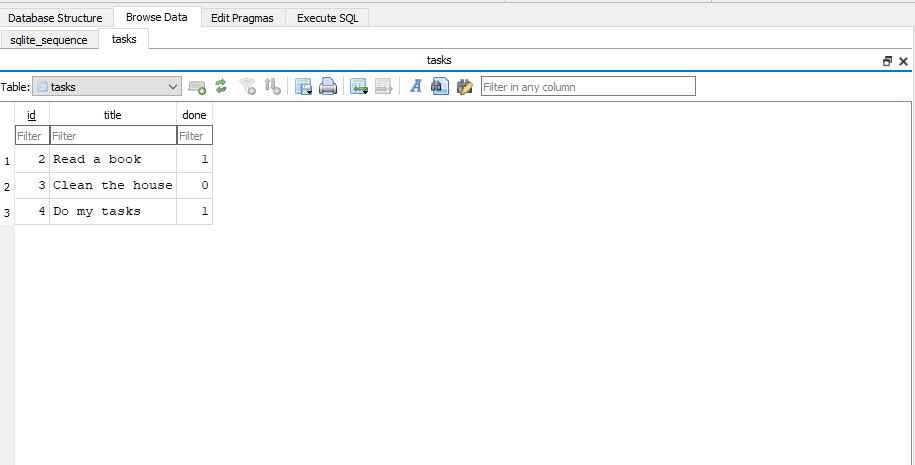

# Task API — SQLite Edition

A simple CRUD API for managing to-do tasks, built with **FastAPI** and backed by a **SQLite** database. This is a continuation of the original in-memory Task API (Assignment 1) — the endpoints, request bodies, and responses are unchanged. Only the storage layer changed: tasks now persist in a real database file instead of disappearing every time the server restarts.

## Why SQLite

SQLite was chosen because it requires no separate database server to install, configure, or run — it's a lightweight database engine that stores everything in a single file. That makes it ideal for a small project like this one, where the goal is to learn how persistence works without the overhead of managing a full database server (like SQL Server or PostgreSQL). Python also has built-in support for SQLite (`sqlite3`), so no extra installation was needed for the database itself.

## Where the database file is stored

The database lives in a file named `tasks.db`, created automatically in the project's root folder (next to `main.py`) the first time the server runs. If the file or the `tasks` table doesn't exist yet, the app creates them on startup. Three example tasks are inserted only the first time the table is empty, so restarting the server never duplicates them.

## How to run the project

1. Clone the repository and open a terminal in the project folder.
2. Install the dependencies:
   ```bash
   pip install -r requirements.txt
   ```
3. Start the server:
   ```bash
   uvicorn main:app --reload
   ```
4. Open your browser at [http://127.0.0.1:8000/docs](http://127.0.0.1:8000/docs) to try out the API interactively via Swagger UI.

The database file `tasks.db` will be created automatically on first run — no manual setup required.

## API Endpoints

| Method | Endpoint         | Description                          |
|--------|------------------|---------------------------------------|
| GET    | `/`              | API info                              |
| GET    | `/health`        | Health check                          |
| GET    | `/tasks`         | Get all tasks                         |
| GET    | `/tasks/{id}`    | Get a single task by ID               |
| POST   | `/tasks`         | Create a new task                     |
| PUT    | `/tasks/{id}`    | Update a task's title and/or status   |
| DELETE | `/tasks/{id}`    | Delete a task                         |

## Exploring the database

The database was inspected using **DB Browser for SQLite**. Below is a screenshot of the `tasks` table with data added through the API:



### Example SQL query

```sql
SELECT * FROM tasks WHERE done = 1;
```

This query was run directly in DB Browser's **Execute SQL** tab and returned only the tasks marked as completed — confirming that changes made through the API are immediately reflected in the underlying database, and vice versa.

## Notes

- Data now survives server restarts (a real database replaces the old in-memory list).
- The database and table are created automatically if missing.
- All CRUD operations (`GET`, `POST`, `PUT`, `DELETE`) run through parameterized SQL queries.
